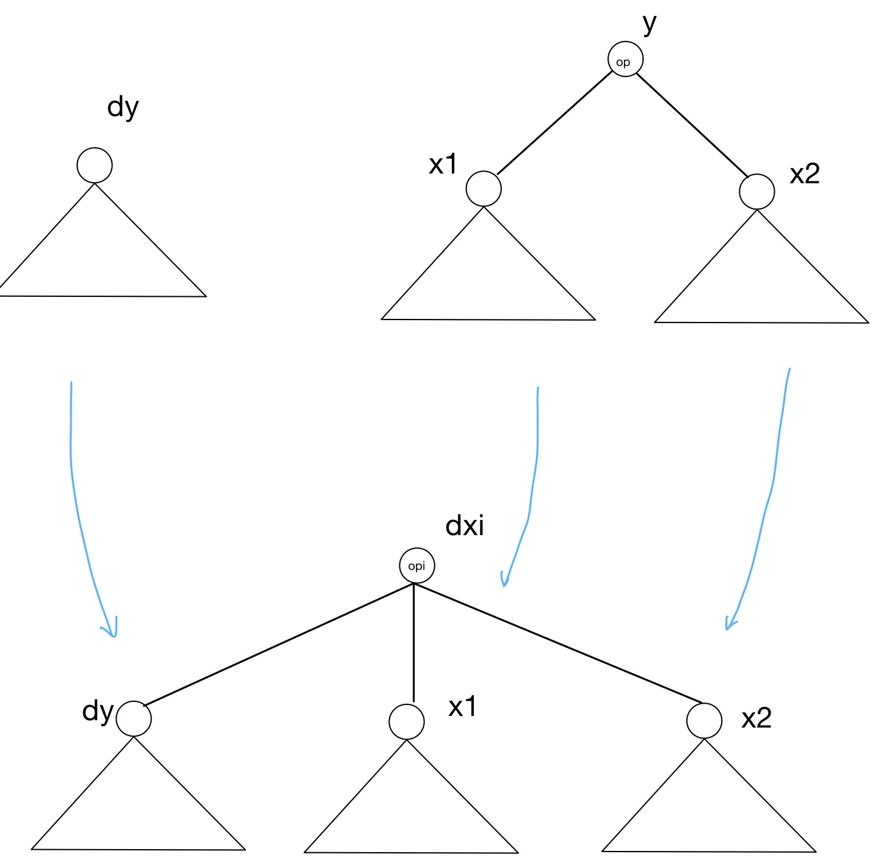

对于一个表达式树，考虑某个节点`y`，对应操作符为op，记其所有子节点为`x1`,...,`xn`。在表达式树求值的过程中，我们会自底向上先计算节点`x1`处的值`x1.val`，直到计算完`xn.val`，后利用这n个值来计算`y`节点的取值`y.val`：
$$
    y.val = op(x_1.val, x_2.val, \cdots, x_n.val)
$$
自动求导的过程如下：假设我们已有计算最终的函数值$L$对`y.val`的梯度$\frac{\partial L}{\partial y.val}$的表达式树，记为`dy`, 我们希望将梯度传递到子节点，也就是对每个`xi`，分别构造另一颗表达式树`dxi`，用于计算梯度$\frac{\partial L}{\partial x_i.val}$。

利用链式求导法则，我们有：
$$
    \frac{\partial L}{\partial x_i.val} = \frac{\partial L}{\partial y.val} \frac{\partial y.val}{\partial x_i.val}
$$
其中$\frac{\partial y.val}{\partial x_i.val}$这一项的表达式仅于依赖操作op，其取值则只依赖于`x1`,...,`xn`的取值。也就是说，我们可以构造另一个运算符op_i，其有$n+1$个输入，分别是`x1`,...,`xn`和`dop`的取值，输出则是梯度$\frac{\partial L}{\partial x_i}$。这样，以op_i为根节点，将计算`x1`,...,`xn`和`dop`的表达式树作为子树连接到`op_i`上得到的树，就是所求的`dxi`。

如下图所示：

对于常见的操作符，我们列出其求导算子如下：

 - y = x1 + x2; dx1 = dy; dx2 = dy;
 - y = x1 - x2; dx1 = dy; dx2 = -dy;
 - y = x1 * x2; dx1 = dy * x2; dx2 = dy * x1;
 - y = x1 / x2; dx1 = dy / x2; dx2 = - x1 / (x2 * x2) * dy

-----

以case10为例。

`A<8, 8>[i, j] = (B<10, 8>[i, j] + B<10, 8>[i + 1, j] + B<10, 8>[i + 2, j]) / 3.0;`

可以构建表达式树如下：

            A[i,j]   =   ( / )
                        /     \
                      ( + )    3.0
                    /      \
                  ( + )    B[i + 2, j]
                /     \
              B[i, j]  B[i + 1, j]        

表达式树的每一个节点都是一个运算符，其连接着若干个操作数。对运算符op，记对应的运算为`z = op (x,y)`，当给定最终输出关于`z`的梯度$\frac{\partial L}{\partial z}$后，我们需要将梯度的信息沿着这个节点传递到表达式树的下端，也就是说，我们需要计算：
$$
    \frac{\partial L}{\partial x} = op1 (x,y,\frac{\partial L}{\partial z}) = \frac{\partial L}{\partial z} * \frac{\partial z}{\partial x}
$$
和
$$
    \frac{\partial L}{\partial y} = op2 (x,y,\frac{\partial L}{\partial z}) = \frac{\partial L}{\partial z} * \frac{\partial z}{\partial y}
$$
对于case10，假设我们已知最终的函数关于A的梯度dA, 对于根节点运算符`/`，记$z = x/y$，我们有
$$
    dx = dz/y
$$
且
$$
    dy = - \frac{x}{y^2} * dz
$$
利用这两个法则，可以将梯度传递到根节点的两个儿子。其右边的儿子的梯度为`-\frac{val(+)}/{3.0}^2 dA`。左边的儿子是另一个运算符`+`，利用求导法则，我们可以得到最终输出关于`+`节点的导数为$dA/3.0$。

接下来继续这个过程，将梯度沿着`+`节点传到表达式树的下端。对于`z=x+y`而言，我们有
$$
    dx = dz, dy = dz
$$
利用这个简单的法则，我们知道，对于这个`+`的右儿子，有`dB = dA/3.0`, 添加上指标信息就是`dB[i+2,j] = dA[i,j]/3.0`。对于这个`+`的左儿子，同样其梯度为`dA/3.0`。再继续这个过程。对第二个`+`，继续将梯度传到左右儿子，分别得到`dB[i,j] = dA[i,j]/3.0`和`dB[i+1,j] = dA[i,j]/3.0`。

我们将梯度沿着表达式树传递到底端后，只需要看所有叶子节点，将所求的梯度**累加**起来即可。也就是先初始化`dB[i,j]=0`，然后执行：`dB[i,j] += dA[i,j]/3.0`,`dB[i+1,j] += dA[i,j]/3.0`和`dB[i+2,j] += dA[i,j]/3.0`.

综上，我们得到了三条累加式：

    dB[i,j] += dA[i,j]/3.0
    dB[i+1,j] += dA[i,j]/3.0
    dB[i+2,j] += dA[i,j]/3.0

下一步，我们需要对表达式左端的指标进行化简。引入一个新的变量`u`并令`u=i+1`，由于新变量`u`的引入，我们可以反过来将表达式中的一个变量用剩余的变量表示出来。这里只有`i`一个变量（而case6中有两个），我们计算出`i=u-1`，并将其回代入该累加式的所有部分，得到`dB[u,j] += dA[u-1,j]/3.0`。同时注意需要对`u`和`u-1`的取值范围进行推断。